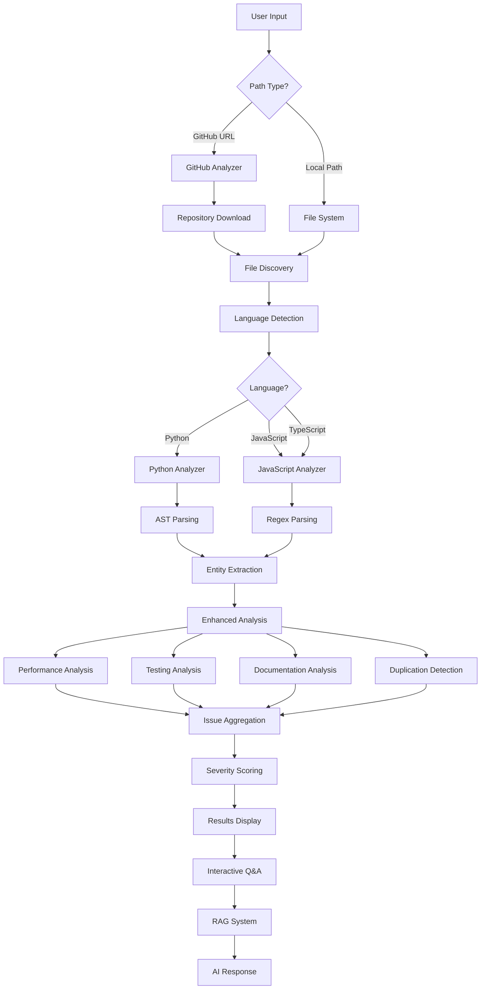
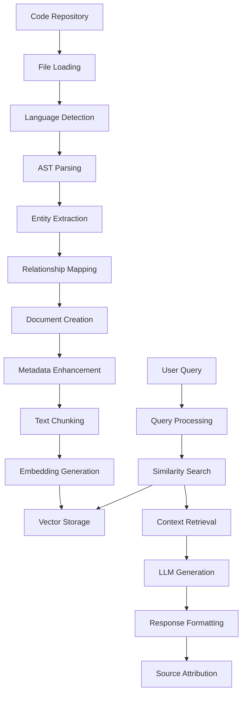

# 🏗️ Code Quality Intelligence Agent - Project Architecture

## 📋 Table of Contents
1. [Project Overview](#project-overview)
2. [System Architecture](#system-architecture)
3. [Core Components](#core-components)
4. [Enhanced RAG System](#enhanced-rag-system)
5. [Analysis Engine](#analysis-engine)
6. [CLI Interface](#cli-interface)
7. [Data Flow](#data-flow)
8. [Technology Stack](#technology-stack)
9. [Deployment Architecture](#deployment-architecture)

---

## 🎯 Project Overview

The **Code Quality Intelligence Agent** is an AI-powered system that provides comprehensive code analysis, quality assessment, and interactive Q&A capabilities for code repositories. It combines traditional static analysis with advanced AI-powered insights through an enhanced RAG (Retrieval-Augmented Generation) system.

### Key Features
- **Multi-language Support**: Python, JavaScript, TypeScript, JSX, TSX
- **Enhanced RAG System**: Code-aware retrieval with AST parsing and entity extraction
- **Interactive CLI**: Rich, professional command-line interface with beautiful output
- **GitHub Integration**: Direct analysis of GitHub repositories via URL
- **Security Analysis**: Vulnerability detection and risk assessment
- **Performance Analysis**: Bottleneck identification and optimization suggestions
- **Documentation Analysis**: Coverage and quality assessment
- **Testing Analysis**: Gap identification and coverage recommendations
- **Docker Support**: Containerized deployment with memory optimization
- **AI-Powered Q&A**: Natural language queries about codebase structure and issues

---

## 🏛️ System Architecture

```mermaid
graph TB
    subgraph "User Interface Layer"
        CLI[CLI Interface]
        INTERACTIVE[Interactive Chat]
        GITHUB_CLI[GitHub CLI]
    end
    
    subgraph "Core Application Layer"
        QA_AGENT[Q&A Agent]
        ANALYZER[Code Analyzer]
        CONFIG[Configuration Manager]
        LAUNCHER[Launcher]
    end
    
    subgraph "Analysis Engine"
        ENHANCED_RAG[Enhanced RAG System]
        BASIC_RAG[Basic RAG System]
        AST_PARSER[AST Parser]
        PATTERN_MATCHER[Pattern Matcher]
        SEVERITY_SCORER[Severity Scorer]
        VISUALIZER[Visualizer]
    end
    
    subgraph "Specialized Analyzers"
        PYTHON_ANALYZER[Python Analyzer]
        JS_ANALYZER[JavaScript Analyzer]
        PERFORMANCE_ANALYZER[Performance Analyzer]
        TESTING_ANALYZER[Testing Analyzer]
        DOC_ANALYZER[Documentation Analyzer]
        DUP_DETECTOR[Duplication Detector]
    end
    
    subgraph "Data Processing"
        GITHUB_ANALYZER[GitHub Analyzer]
        LANGUAGE_DETECTOR[Language Detector]
        CODE_STRUCTURE[Code Structure Analyzer]
    end
    
    subgraph "Storage Layer"
        VECTOR_DB[(Vector Database)]
        CHROMA_DB[(ChromaDB)]
        FILE_SYSTEM[(File System)]
        CACHE[(Cache)]
    end
    
    subgraph "External Services"
        OPENAI[OpenAI API]
        GROQ[Groq API]
        GITHUB_API[GitHub API]
        HUGGINGFACE[HuggingFace Models]
    end
    
    CLI --> QA_AGENT
    INTERACTIVE --> QA_AGENT
    GITHUB_CLI --> GITHUB_ANALYZER
    
    QA_AGENT --> ENHANCED_RAG
    QA_AGENT --> ANALYZER
    ANALYZER --> PYTHON_ANALYZER
    ANALYZER --> JS_ANALYZER
    ANALYZER --> PERFORMANCE_ANALYZER
    ANALYZER --> TESTING_ANALYZER
    ANALYZER --> DOC_ANALYZER
    ANALYZER --> DUP_DETECTOR
    
    ENHANCED_RAG --> AST_PARSER
    ENHANCED_RAG --> CODE_STRUCTURE
    ENHANCED_RAG --> VECTOR_DB
    
    GITHUB_ANALYZER --> GITHUB_API
    QA_AGENT --> OPENAI
    QA_AGENT --> GROQ
    ENHANCED_RAG --> HUGGINGFACE
    
    VECTOR_DB --> CHROMA_DB
    CODE_STRUCTURE --> FILE_SYSTEM
    ANALYZER --> SEVERITY_SCORER
    ANALYZER --> VISUALIZER
```



---

## 🧩 Core Components

### 1. **CLI Interface** (`cli.py`)
The main entry point providing a professional command-line interface with rich output formatting.

**Key Features:**
- Beautiful terminal UI using Rich library
- Progress indicators and spinners
- Color-coded output and tables
- Support for GitHub URLs and local paths
- Multiple output formats (JSON, HTML, Markdown)

**Commands:**
- `analyze`: Run code quality analysis
- `chat`: Start interactive Q&A session
- `search`: Search GitHub repositories

### 2. **Interactive CLI** (`interactive_cli.py`)
Enhanced interactive command-line interface with conversational Q&A capabilities.

**Key Features:**
- Professional welcome screen with project info
- Command detection and processing
- Rich help system with examples
- Conversation history management
- Real-time analysis results display
- Export functionality for results

### 3. **Q&A Agent** (`qa_agent.py`)
AI-powered question-answering system with RAG integration.

**Key Features:**
- LangChain integration for LLM orchestration
- Multi-LLM support (OpenAI, Groq)
- Conversation memory management
- Enhanced context retrieval
- Source attribution
- Fallback mechanisms for API failures

### 4. **Configuration Manager** (`config.py`)
Centralized configuration management using Pydantic.

**Configuration Sections:**
- **Analysis**: File size limits, supported languages, severity thresholds
- **RAG**: Vector database path, embedding models, chunk settings
- **GitHub**: API token, base URL, timeout settings
- **AI**: LLM provider selection, API keys, model settings

---

## 🔍 Enhanced RAG System

### **Enhanced RAG System** (`enhanced_rag_system.py`)
Advanced RAG system with code structure understanding and entity extraction.

**Key Components:**

#### **Code Structure Analyzer**
- **Python AST Processing**: Uses Python's `ast` module for deep structural analysis
- **JavaScript/TypeScript Processing**: Regex-based parsing for function/class extraction
- **Entity Extraction**: Identifies functions, classes, variables, imports
- **Relationship Mapping**: Tracks dependencies, calls, and inheritance

#### **Document Processing Pipeline**
1. **Code Analysis**: AST parsing and entity extraction
2. **Metadata Enhancement**: Rich metadata with line numbers, types, relationships
3. **Document Creation**: Comprehensive documents with code content and context
4. **Text Splitting**: Intelligent chunking for vector storage

#### **Vector Store Integration**
- **ChromaDB**: Vector database for similarity search
- **Sentence Transformers**: Embedding generation with code context
- **Metadata Filtering**: Complex filtering by entity type and relationships
- **Source Attribution**: Precise file/line/function references

### **Basic RAG System** (`rag_system.py`)
Fallback RAG system for when enhanced features are unavailable.

**Features:**
- Simple document loading and chunking
- Basic vector store operations
- Local embedding support
- Error handling and fallbacks

---

## 🔧 Analysis Engine

### **Code Analyzer** (`analyzer.py`)
Main analysis orchestrator that coordinates different analysis engines.

**Architecture:**
- **Language Detection**: Automatic language identification
- **Analyzer Selection**: Routes to appropriate language-specific analyzers
- **Issue Aggregation**: Combines results from multiple analyzers
- **Categorization**: Groups issues by type and severity

### **Language-Specific Analyzers**

#### **Python Analyzer** (`analyzer.py`)
Comprehensive Python code analysis with AST-based inspection.

**Analysis Types:**
- **Security**: Hardcoded passwords, SQL injection, eval usage
- **Complexity**: Long functions, nested loops, parameter count
- **Style**: Line length, multiple statements, formatting
- **Documentation**: Missing docstrings, module documentation

#### **JavaScript Analyzer** (`analyzer.py`)
JavaScript/TypeScript code analysis with pattern matching.

**Analysis Types:**
- **Security**: eval usage, innerHTML assignments, XSS vulnerabilities
- **Performance**: DOM queries, synchronous operations, memory leaks
- **Style**: var usage, loose equality, modern patterns
- **Best Practices**: Console.log detection, proper error handling

### **Enhanced Analyzers** (`enhanced_analyzer.py`)
Advanced analysis capabilities beyond basic static analysis.

#### **Performance Analyzer**
- Inefficient loop detection
- String concatenation analysis
- Memory leak identification
- Synchronous operation detection

#### **Testing Analyzer**
- Test file detection
- Coverage gap analysis
- Complex function identification
- Test framework recommendations

#### **Documentation Analyzer**
- Module docstring checking
- Function/class documentation analysis
- JSDoc comment validation
- Documentation coverage assessment

#### **Duplication Detector**
- Code similarity analysis
- Cross-file duplication detection
- Jaccard similarity calculation
- Refactoring suggestions

### **Severity Scorer** (`severity_scorer.py`)
AI-powered severity assessment and prioritization system.

**Scoring Factors:**
- **Impact Assessment**: Critical, High, Medium, Low impact levels
- **Likelihood Evaluation**: Certain, Likely, Possible, Unlikely occurrence
- **Pattern Matching**: Regex-based vulnerability detection
- **Priority Ranking**: P0-P4 priority classification

### **Visualizer** (`visualizer.py`)
Data visualization and reporting capabilities.

**Visualization Types:**
- Issues by category (bar charts)
- Severity distribution (pie/bar charts)
- File complexity analysis (horizontal bar charts)
- Priority matrix (heatmaps)
- Quality trends (line charts)
- Dependency graphs (network diagrams)

---

## 💻 CLI Interface

### **Command Structure**
```
code-quality-agent
├── analyze <path>     # Analyze code quality
├── chat <path>        # Interactive Q&A session
└── search <query>     # Search GitHub repositories
```

### **Interactive CLI Features**

#### **Welcome Screen**
- Project information display
- File count and analysis scope
- AI model and provider information
- Quick action suggestions

#### **Command Processing**
- Smart command detection
- Natural language question handling
- Path resolution (GitHub vs local)
- Error handling and user guidance

#### **Output Formatting**
- Rich panels and tables
- Color-coded severity levels
- Progress indicators
- Professional styling

#### **Help System**
- Comprehensive command reference
- Example questions and use cases
- Category-based help organization
- Interactive guidance

---

## 🔄 Data Flow

### **Analysis Pipeline**



### **RAG Processing Pipeline**



---

## 🛠️ Technology Stack

### **Core Technologies**
- **Python 3.11+**: Main programming language
- **LangChain**: LLM framework and orchestration
- **ChromaDB**: Vector database for RAG
- **Sentence Transformers**: Embedding generation

### **AI/ML Libraries**
- **OpenAI API**: GPT models for analysis
- **Groq API**: Fast inference for Q&A
- **HuggingFace**: Embedding models and transformers
- **LangChain Community**: Additional integrations

### **Analysis Tools**
- **AST Module**: Python code parsing
- **Regex**: JavaScript/TypeScript parsing
- **NetworkX**: Graph analysis and visualization
- **Matplotlib/Seaborn**: Data visualization

### **CLI and UI**
- **Click**: Command-line interface framework
- **Rich**: Terminal UI and formatting
- **Pydantic**: Configuration management and validation
- **Python-dotenv**: Environment variable management

### **Infrastructure**
- **Docker**: Containerization
- **Docker Compose**: Multi-service orchestration
- **Git**: Version control integration
- **Requests**: HTTP client for API calls

### **Development Tools**
- **Pytest**: Testing framework
- **Black**: Code formatting
- **Flake8**: Linting
- **Tree-sitter**: Advanced parsing (optional)

---

## 🚀 Deployment Architecture

### **Docker Configuration**

#### **Multi-stage Build** (`Dockerfile`)
- **Builder Stage**: Install dependencies and build packages
- **Production Stage**: Minimal runtime environment
- **Memory Optimization**: Configured for 1GB RAM usage
- **Security**: Non-root user execution

#### **Docker Compose** (`docker-compose.yml`)
- **Enhanced RAG Chat Service**: Interactive Q&A with code understanding
- **Code Analyzer Service**: AST parsing and quality assessment
- **GitHub Analyzer Service**: Repository analysis and search
- **Volume Management**: Persistent data and configuration
- **Memory Limits**: Optimized resource allocation

### **Environment Configuration**

#### **Environment Variables**
```bash
# LLM Configuration
LLM_PROVIDER=groq
GROQ_API_KEY=your_api_key
OPENAI_API_KEY=your_api_key

# Analysis Configuration
MAX_FILE_SIZE_MB=10
SUPPORTED_LANGUAGES=python,javascript,typescript
DEFAULT_SEVERITY_THRESHOLD=medium

# RAG Configuration
VECTOR_DB_PATH=./data/vector_db
EMBEDDING_MODEL=sentence-transformers/all-MiniLM-L6-v2

# Memory Optimization
PYTORCH_CUDA_ALLOC_CONF=max_split_size_mb:128
TOKENIZERS_PARALLELISM=false
OMP_NUM_THREADS=1
```

### **Deployment Options**

#### **Local Development**
```bash
# Install dependencies
pip install -r requirements.txt

# Run setup
python setup.py

# Start interactive CLI
python -m code_quality_agent chat .

# Analyze code
python -m code_quality_agent analyze . --enhanced
```

#### **Docker Deployment**
```bash
# Build image
docker build -t code-quality-agent .

# Run analysis
docker run --rm -it -v ${PWD}:/workspace code-quality-agent analyze .

# Interactive chat
docker run --rm -it -v ${PWD}:/workspace code-quality-agent chat .
```

#### **Docker Compose**
```bash
# Start all services
docker-compose up

# Run specific service
docker-compose up enhanced-rag-chat
```

---

## 📊 Performance Characteristics

### **Memory Usage**
- **Base Memory**: ~200MB for core functionality
- **Enhanced RAG**: +300-500MB for vector operations
- **Docker Limit**: 1GB total memory allocation
- **Optimization**: Memory-efficient processing and cleanup

### **Processing Speed**
- **File Analysis**: ~10-50 files per second
- **RAG Indexing**: ~100-500 files per minute
- **Query Response**: 2-5 seconds for complex queries
- **GitHub Analysis**: 1-3 minutes for medium repositories

### **Scalability**
- **Horizontal**: Multiple container instances
- **Vertical**: Memory and CPU scaling
- **Storage**: Persistent vector databases
- **Caching**: Intelligent result caching

---

## 🔮 Future Enhancements

### **Planned Features**
- **Web Interface**: Browser-based UI for analysis
- **Real-time Analysis**: Live code monitoring
- **Team Collaboration**: Shared analysis results
- **CI/CD Integration**: Automated quality gates
- **Custom Rules**: User-defined analysis patterns
- **Multi-repository**: Cross-project analysis

### **Technical Improvements**
- **Advanced Parsing**: Tree-sitter integration
- **Performance Optimization**: Parallel processing
- **Caching Layer**: Redis integration
- **API Endpoints**: RESTful API for integration
- **Monitoring**: Health checks and metrics
- **Testing**: Comprehensive test coverage

---

This architecture provides a robust, scalable, and maintainable foundation for comprehensive code quality analysis with AI-powered insights and interactive capabilities.
