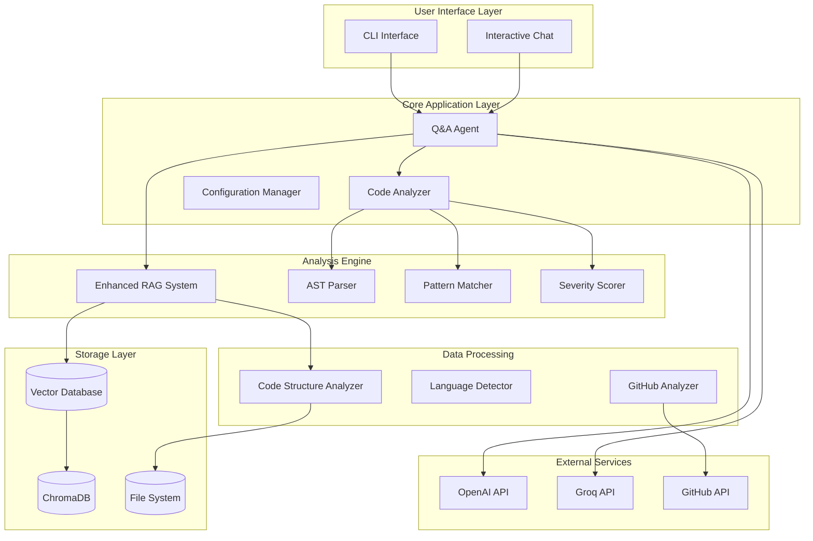
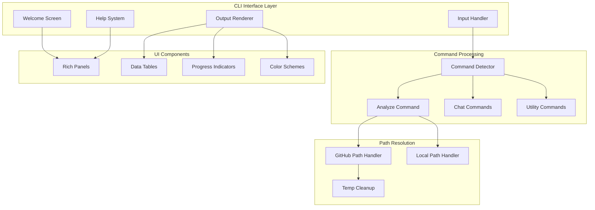
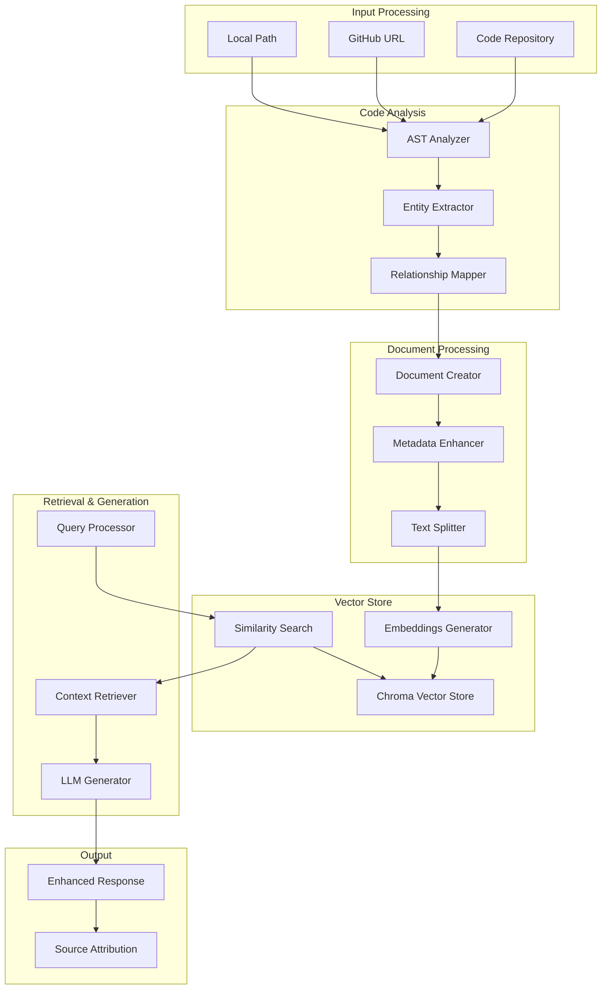
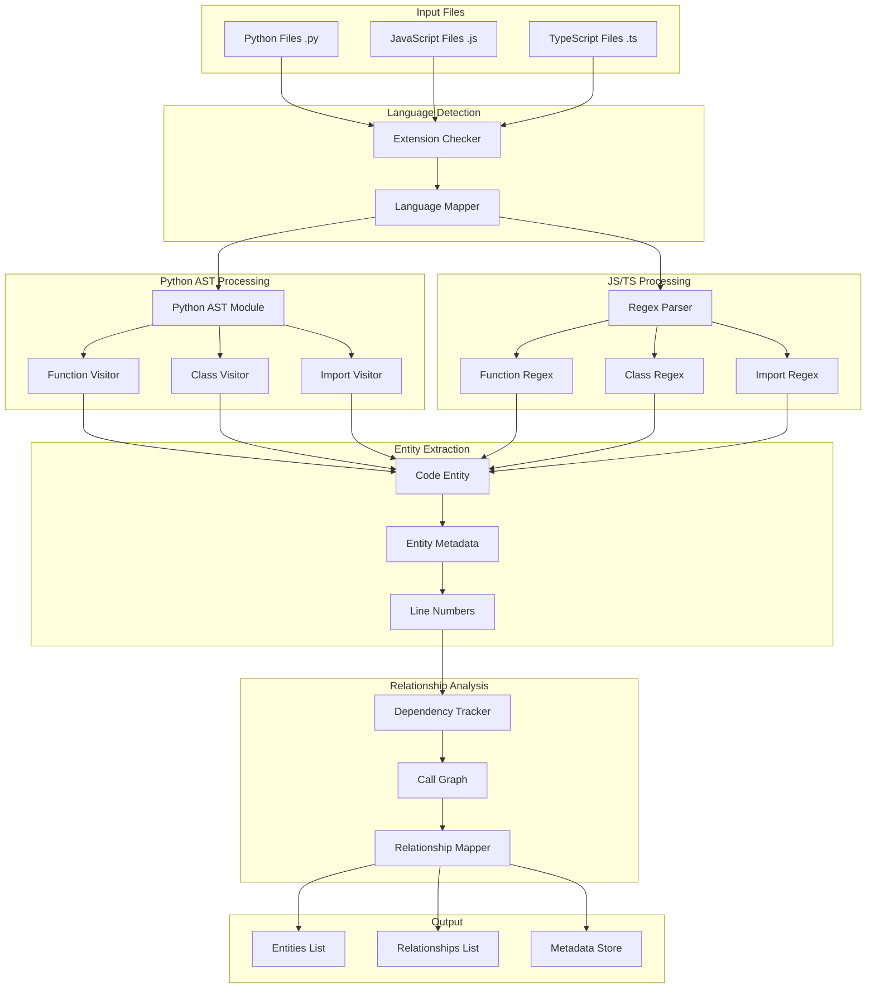
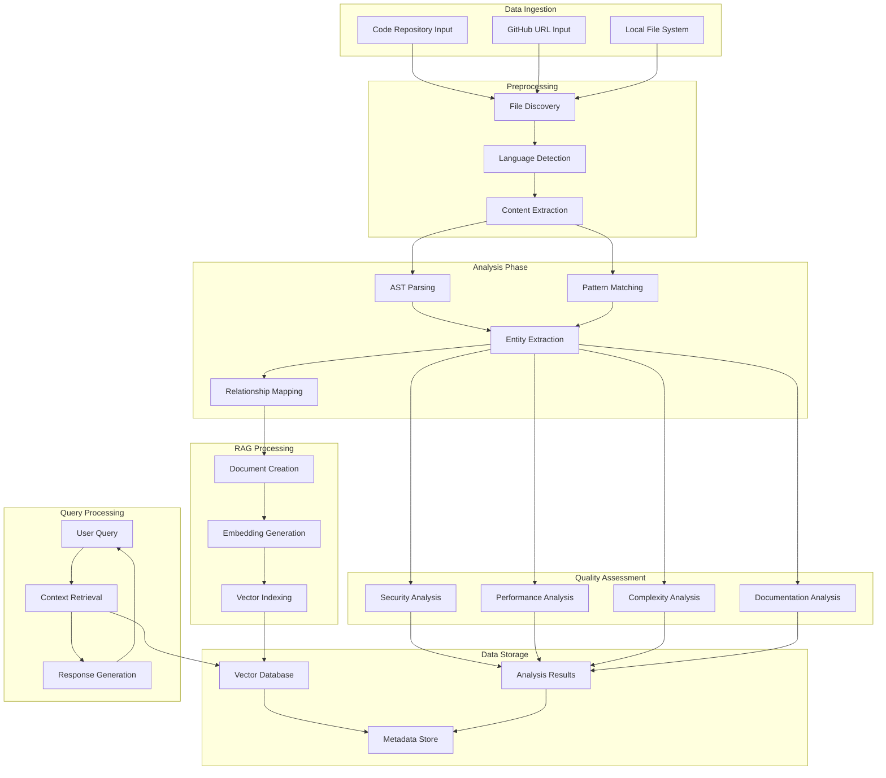
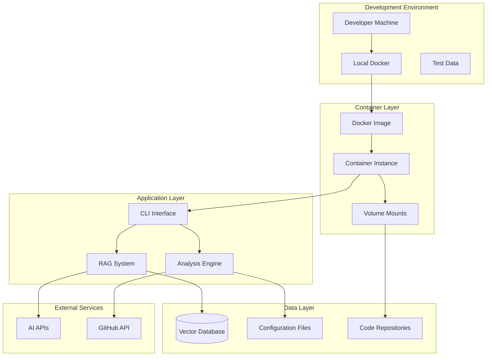

# 🏗️ CodeAnalyzer Pro - Project Architecture

## 📋 Table of Contents
1. [Project Overview](#project-overview)
2. [System Architecture](#system-architecture)
3. [RAG Architecture](#rag-architecture)
4. [AST Parsing Architecture](#ast-parsing-architecture)
5. [Data Pipeline](#data-pipeline)
6. [Component Details](#component-details)
7. [Technology Stack](#technology-stack)

---

## 🎯 Project Overview

The **CodeAnalyzer Pro** is an AI-powered system that analyzes code repositories to provide comprehensive quality insights, security assessments, and architectural recommendations. It goes beyond traditional linting by understanding code relationships, dependencies, and providing conversational Q&A capabilities.

### Key Features
- **Multi-language Support**: Python, JavaScript, TypeScript
- **AST Parsing**: Deep structural analysis of code
- **RAG System**: Retrieval-Augmented Generation for context-aware responses
- **Professional CLI Interface**: Beautiful, interactive command-line experience
- **Security Analysis**: Vulnerability detection and risk assessment
- **Performance Analysis**: Bottleneck identification and optimization suggestions
- **Interactive Q&A**: Natural language queries about codebase
- **GitHub Integration**: Direct repository analysis from URLs
- **Docker Support**: Containerized deployment with memory optimization
- **Memory Optimization**: Efficient resource usage with 1GB RAM limits

---

## 🏛️ System Architecture

---

## 🖥️ CLI Architecture

### Enhanced Interactive CLI Design

The new CLI interface provides a professional, user-friendly experience with the following architectural improvements:

### Key Architectural Improvements

#### 1. Professional UI Design
- **Rich Library Integration**: Beautiful panels, tables, and progress indicators
- **Color-coded Output**: Professional color scheme for better readability
- **Responsive Layout**: Adaptive panels based on terminal size
- **Consistent Styling**: Unified design language throughout

#### 2. Command Processing Architecture
- **Command Detection**: Smart detection of commands vs. natural language questions
- **Path Resolution**: Automatic handling of GitHub URLs vs. local paths
- **Error Handling**: Graceful error display with professional formatting
- **State Management**: Proper initialization and cleanup of components

#### 3. Memory Optimization
- **Docker Memory Limits**: Optimized for 1GB RAM usage
- **Environment Variables**: Memory optimization settings
- **Resource Cleanup**: Automatic cleanup of temporary files
- **Efficient Processing**: Streamlined operations to reduce memory footprint

#### 4. GitHub Integration
- **Direct URL Analysis**: Seamless GitHub repository analysis
- **Automatic Download**: Temporary repository cloning and cleanup
- **Path Resolution**: Automatic path handling for downloaded repositories
- **Metadata Extraction**: Repository information display

---

## 🔍 RAG Architecture

### RAG Components

1. **Code Analysis Pipeline**
   - AST parsing for structural understanding
   - Entity extraction (functions, classes, imports)
   - Relationship mapping (dependencies, calls)

2. **Document Processing**
   - Enhanced metadata with filename, language, AST info
   - Code content inclusion
   - Text chunking for optimal retrieval

3. **Vector Store**
   - ChromaDB for similarity search
   - Sentence Transformers for embeddings
   - Complex metadata filtering

4. **Retrieval & Generation**
   - Context-aware query processing
   - Multi-source retrieval
   - LLM integration with source attribution

---

## 🌳 AST Parsing Architecture

### AST Processing Details

1. **Language Detection**
   - File extension mapping
   - Language-specific processing paths

2. **Python AST Processing**
   - Native `ast` module usage
   - Visitor pattern for traversal
   - Function, class, and import extraction

3. **JavaScript/TypeScript Processing**
   - Regex-based parsing
   - Pattern matching for functions, classes
   - Import statement detection

4. **Entity Extraction**
   - Name, type, line number extraction
   - Docstring and parameter parsing
   - Dependency identification

5. **Relationship Analysis**
   - Call graph construction
   - Dependency mapping
   - Cross-reference tracking

---

## 🔄 Data Pipeline

### Pipeline Stages

1. **Data Ingestion**
   - Multiple input sources (local, GitHub)
   - File discovery and filtering
   - Content extraction

2. **Preprocessing**
   - Language detection
   - File type validation
   - Content normalization

3. **Analysis Phase**
   - AST parsing for structure
   - Pattern matching for issues
   - Entity and relationship extraction

4. **Quality Assessment**
   - Security vulnerability detection
   - Performance bottleneck identification
   - Complexity analysis
   - Documentation gap analysis

5. **Data Storage**
   - Vector database for RAG
   - Metadata storage
   - Analysis result persistence

6. **RAG Processing**
   - Document creation with metadata
   - Embedding generation
   - Vector indexing

7. **Query Processing**
   - Natural language query processing
   - Context retrieval
   - AI-powered response generation

---

## 🧩 Component Details

### Core Components

1. **Q&A Agent** (`qa_agent.py`)
   - LangChain integration
   - Conversation memory
   - Multi-LLM support (OpenAI, Groq)

2. **Enhanced RAG System** (`enhanced_rag_system.py`)
   - ChromaDB vector store
   - Sentence Transformers embeddings
   - Complex metadata handling

3. **Code Analyzer** (`analyzer.py`)
   - Multi-language analysis
   - Issue detection and categorization
   - Severity scoring

4. **AST Parser** (`enhanced_rag_system.py`)
   - Python AST module
   - JavaScript/TypeScript regex parsing
   - Entity relationship mapping

5. **GitHub Analyzer** (`github_analyzer.py`)
   - Repository cloning
   - API integration
   - File structure analysis

6. **Severity Scorer** (`severity_scorer.py`)
   - AI-powered impact assessment
   - Likelihood evaluation
   - Priority ranking

### Data Models

1. **CodeEntity**
   - Name, type, line number
   - Docstring, parameters
   - Dependencies

2. **CodeRelationship**
   - Source and target entities
   - Relationship type
   - Line number reference

3. **CodeIssue**
   - Issue type and description
   - Severity and priority
   - Suggested fixes

---

## 🛠️ Technology Stack

### Core Technologies
- **Python 3.11+**: Main programming language
- **LangChain**: LLM framework and orchestration
- **ChromaDB**: Vector database for RAG
- **Sentence Transformers**: Embedding generation

### AI/ML Libraries
- **OpenAI API**: GPT models for analysis
- **Groq API**: Fast inference for Q&A
- **HuggingFace**: Embedding models

### Analysis Tools
- **AST Module**: Python code parsing
- **Regex**: JavaScript/TypeScript parsing
- **NetworkX**: Graph analysis
- **Matplotlib/Seaborn**: Visualization

### Infrastructure
- **Docker**: Containerization
- **Click**: CLI framework
- **Rich**: Terminal UI
- **Pydantic**: Configuration management

### Development Tools
- **Git**: Version control
- **Docker Compose**: Orchestration
- **Pytest**: Testing framework

---

## 🚀 Deployment Architecture

This architecture ensures scalability, maintainability, and ease of deployment while providing comprehensive code analysis capabilities.
